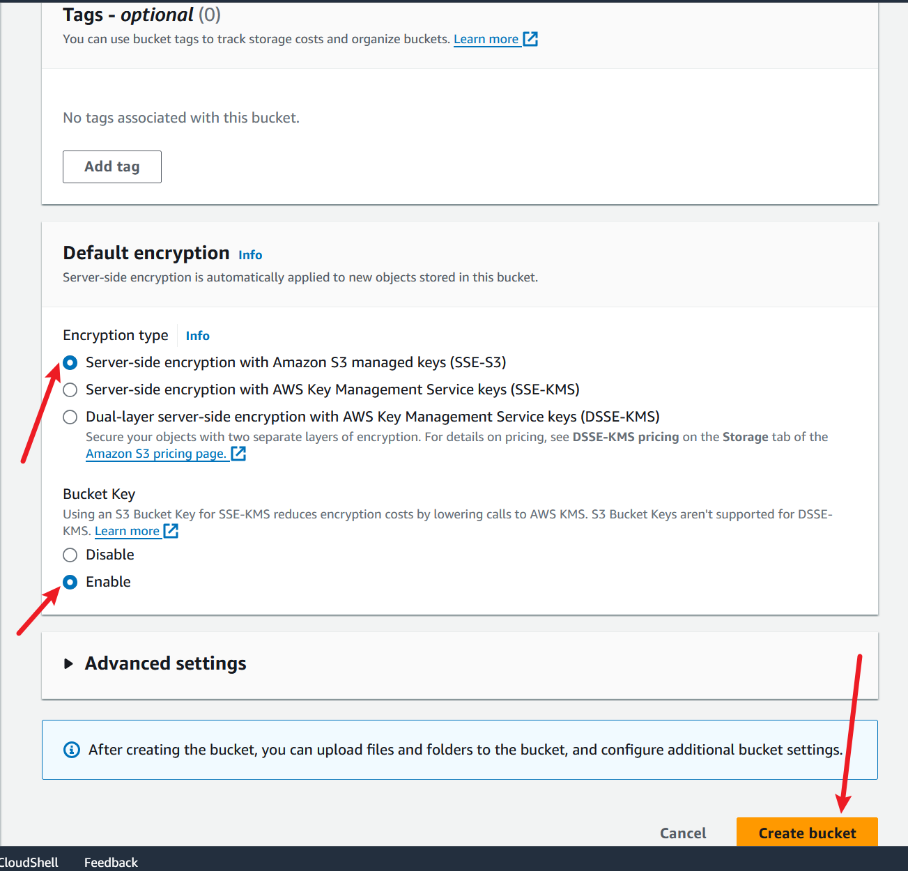

# AWS-S3-Bucket-Exploration
Working with Amazon S3 (Simple Storage Service), a vital component of Amazon Web Services (AWS) for storing and accessing data. We will go through concepts like buckets, objects, versioning,permissions management, and lifecycle policies. 

## Project Goals:
The Primary goal of this project is to familiarize participants with Amazon S3 (Simple Storage Service) and its fundamental concepts. You will learn how to create and manage S3 buckets, upload objects, enable versioning, set permissions for public access, and implement lifecycle policies.

## Objectives: 
- Create and configure S3 bucket using the AWS Management Console.
- Upload files and manage objects within S3 buckets. 
- Understand the importance of versioning and its implications and data management.
- Configure permissions to control access to S3 objects.
- Implement lifecycle policies to automate data management tasks and optimize storage costs.

## Creation of an Amazon S3 bucket.
Amazon S3 (Simple Storage Service) is a cloud-based object storage service provided by Amazon Web Services (AWS). It allows users to store and retrieve large amounts of data.

1. First, navigate to the search bar on the AWS console.

a) Search for "S3"

2. Once you click on S3, you'll be directed to S3 page.

a) From there, locate and click on the "Create bucket" button.

3. We will follow the steps to create a new bucket. Provide a unique name for the bucket which will.

a) Select "ACL Disabled" for object ownership. 

b) Check the "Block all public access" option, this is necessary.

c) Leave the Bucket Versioning disabled.

d) Proceed with the default settings.

e) Finally, click on the "Create bucket" button to finalize the bucket creation process.

### *Note:*  
In Amazon S3, ACLs are used to control access to buckets and objects, allowing you to specify permissions for users, groups, or AWS accounts. It is a way to control who gets to see or touch your data in the cloud.

f) You will notice that your bucket has been successfully created without any objects in it.

## The next part of this project is to upload an object into the bucket we just created.

Object refers to a file or a collection of data that is stored in a bucket in Amazon S3 (Simple Storage Service).

1. Click on the "upload" button.

2. Click on "Add file" and select the file you want to upload.

a) Once selected, click "Open"

3. The file will be added.

4. Click on "upload" to complete the process.

You have  successfully uploaded your object (file) to the S3 bucket (folder).

## The next step for us in this project is to enable versioning. 

1. Navigate back to your bucket.

2. Click on "properties" 

3. In the bucket's properties section, you will notice that the bucket versioning is currently disabled.

.

We'll enable it.

4. Click on edit,

5. Select "Enable"

a) Then click on "Save changes" this will enable versioning for the bucket. 

6. Now, if you make changes to the object or file that you uploaded and upload it again, you'll create a new version of the file.
In this case we will add a text to the image we uploaded earlier.

a) By clicking on "Show versions", you'll be able to see all the versions of the file you've uploaded.

b) Be aware that whenever you make changes to the file and upload it again to the same bucket, it will continue creating versions of that file for future reference.

## In order to view the content for both files we will have to set up permissions which will be the next step.

1. In the buckets  click on  permission ,you will notice that "Block all public access" is enabled.

a) Click on "Edit" to make changes.

2. Uncheck the "Block all public access" option.

a) Then click on the "save changes"

b) Go ahead and type "Confirm" and click "Confirm.

This action allows your file to be publicly accessible. This confirmation step ensures that you are aware of the implications of making your file public.

3.You need to create a bucket policy to specify the actions you want the public to be able to perform on your file.
Click on "Edit".

4. Now, click on the "Policy generator"

5. Select the "Type of Policy" as "S3 Bucket Policy"

a) Set the "Effect" to "Allow",

b) Specify the "Principal" as "*", which means all users.

c) Choose the action "Get object" and "Get object version",

d) In the field of Amazon Resource Name (ARN),type the ARN of your bucket and add by "/*" after the ARN or you can copy it, navigate back.

e) Copy the resource name 

e) Click on "Add statement".

### Note:
ARN stands for Amazon Resource Name. It's like a unique address for every resource in AWS, such as buckets in S3.

6. Now click on "generate policy"

a) Copy this and click on "Close"

b) Navigate to the bucket policy tab.

c) Paste the policy you've created and copied using the Policy Generator.

7. Click on "Save Changes" 

8.Now, click on this version of your file.

a)  Click on the object URL

Here you'll see the previous data.

9. Click on the latest version,

a) Click on the object URL 

You'll get the latest one too which was modified with a text.

## Lastly, lets proceed to the next step, which involves creating lifecycle policies.

1. Navigate to the management section of the bucket. 

a) Click on "Add Lifecycle rule".

2. Give the specifications, and click to create rule.

The lifecycle policy is being created successfully.

.

This rule is set up to automatically move files from one type of storage to another in your Amazon S3 bucket. Specifically, it moves files to a storage type called Standard-IA after they've been sitting in your bucket for 30 days. Standard-IA storage is cheaper than the default storage option. So, if you have files that you don't access very often but still want to keep, this rule helps you save costs by storing them in a cheaper storage class after a certain period of time.

Thank you.

